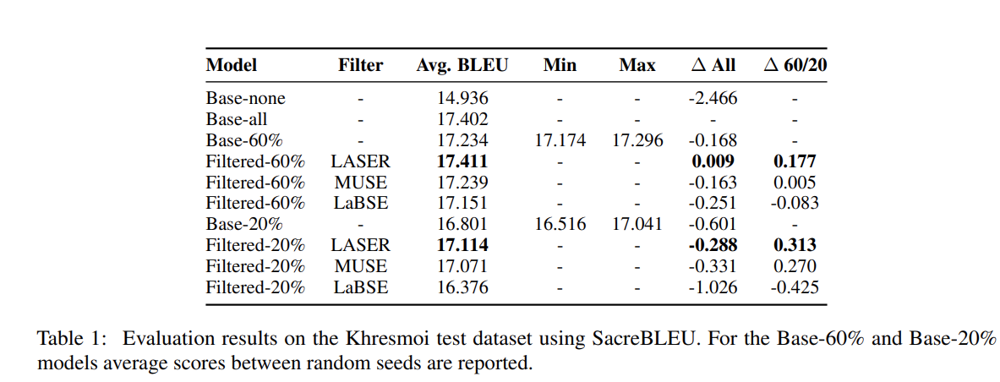

    

# Biomed-NMT-EngPol

Repository containing source code, data and results for paper "A comparison of data filtering techniques for English-Polish neural machine translation in the biomedical domain", started as final project for Advanced Natural Language Processing and Deep Learning, course at [IT University of Copenhagen](https://en.itu.dk/) and further developed for publication.

Experiments were run on [LUMI supercomputer](https://www.lumi-supercomputer.eu/about-lumi/) and full report 
can be found here: [paper_report.pdf](paper_report.pdf).

This paper was **accepted for presentation at [KONVENS 2024](https://konvens-2024.univie.ac.at/)**.  
Unfortunately, we had to **withdraw** due to limited availability of our members to attend.

You can still access the full paper here:  
📄 [https://doi.org/10.48550/arXiv.2501.16533](https://doi.org/10.48550/arXiv.2501.16533)

## Authors
The authors of the projects are the following:
- [*Jorge del Pozo Lerida*](https://github.com/jorgedelpozolerida)
- [*Kamil Kojs*](https://github.com/KamilKojs)
- [*Janos Mate*](https://github.com/matejanos)
- [*Mikolaj Baranski*](https://github.com/MikolajBaranski)
- [*Christian Hardmeier*](https://github.com/chardmeier)

## Title
"A comparison of data filtering techniques for English-Polish neural machine translation in the biomedical domain"

## Abstract
Large Language Models (LLMs) have become the state-of-the-art in Neural Machine Translation (NMT), often trained on massive bilingual parallel corpora scraped from the web, which contain low-quality entries and redundant information, leading to overall significant computational challenges. Various data filtering methods exist to reduce dataset sizes, but their effectiveness largely varies based on specific language pairs and domains. This paper evaluates the impact of commonly used data filtering techniques—LASER, MUSE, and LaBSE—on English-Polish translation within the biomedical domain. By filtering the UFAL Medical Corpus, we created varying dataset sizes to fine-tune the mBART50 model, which was then evaluated using the SacreBLEU metric on the Khresmoi dataset, having quality of translations assessed by bilingual speakers. Our results show that both LASER and MUSE can significantly reduce dataset sizes while maintaining or even enhancing performance. We recommend the use of LASER, as it consistently outperforms the other methods and provides the most fluent and natural-sounding translations.

## Methods & Results
We employed three widely used multilingual language-agnostic embedding models — LASER, MUSE, LaBSE —  to filter and subset the medical-domain corpus using cosine similarity.  Based on these scores we kept 20\% ($\sim$ 150k pairs) and 60\% ($\sim$ 420k pairs) of the best scoring sentences for each method. These six (two sizes per method) filtered datasets were used to create fine-tuned mBART50 models.

To allow us to compare the effect the effect of filtering, a baseline model was trained on the full unfiltered dataset (Base-all), and further models were trained on three randomly selected 20\% and 60\% subsets of the data (Base-20\% and Base-60\%) that is, three models trained for every sample size whose evaluation performance will be averaged.

Best performing model can be downloaded [in this link](https://drive.google.com/drive/folders/1J34pPHRLr0YesR_gekR6Wm7SD7rDgirB?usp=sharing).

Evaluation was conducted on an independent dataset using SacreBLEU method for the BLEU metric. Results:

## Repository structure overview

These files are present in root folder:
* [paper_report.pdf](paper_report.pdf): PDF with full report of the project
* [Bibliography](bibliography.bib): bib file containing bibliography used

The following folders are present in the repo:

### [Data](data/)
Contains all light-weight files used in the project, like evaluaiton results and filtered ids
from original corpus.

### [LUMI](LUMI/)
This folder contains all scripts, logs and slurm jobs executed on LUMI supercomputer 
during experimentation. 

The following scripts are worth mentioning:
* [tokenize_dataset.py](LUMI/src/tokenize_dataset.py): script to generate tokenized splits from different sources: train, validation and test sets.
* [train.py](LUMI/src/train.py): script to execute training of mBART50
* [evaluate.py](LUMI/src/evaluate.py): script to execute evaluation on test set

### [Local scripts](src/)
This folder hosts Python scripts and notebooks run locally used for several tasks
of the project.
<!-- * [BERT_embedding_gen.py](src/BERT_embedding_gen.py): calculates the similiraty between English and Polish sentences with BERT model -->
<!-- * [BERT_filtering_levels.ipynb](src/BERT_filtering_levels.ipynb): generate different levels of filtering with BERT model -->
* [muse.ipynb](src/muse.ipynb): calculates the similiraty between English and Polish sentences with MUSE model. It is necessary to download wiki.multi.en.vec and wiki.multi.pl.vec from https://github.com/facebookresearch/MUSE to run the code.
* [generate_LaBSE_embeddings_similarity.ipynb](src/generate_LaBSE_embeddings_similarity.ipynb): calculates the similiraty between English and Polish sentences with LaBSE model
* [generate_LASER_embeddings_similarity.py](src/generate_LASER_embeddings_similarity.ipynb): calculates the similiraty between English and Polish sentences with LASER model
* [LaBSE_quantile_split.ipynb](src/LaBSE_quantile_split.ipynb): calculates the similiraty between English and Polish sentences with LaBSE model
* [training_analyses.ipynb](src/training_analyses.ipynb): generate plots for the training steps
* [preprocessing.ipynb](src/preprocessing.ipynb): preprocessing of data
* [preprocessing_v2.ipynb](src/preprocessing_v2.ipynb): preprocessing of data
* [lASER_filtering_levels.ipynb](src/lASER_filtering_levels.ipynb): generating subsets of for LASER model
