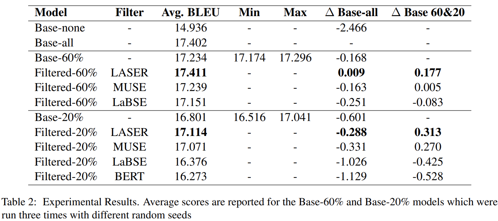

    

# Advanced Natural Language Processing - Final Project

Repository containing source code, data and results of final Group Project for Advanced Natural Language Processing and Deep Learning, course at [IT University of Copenhagen](https://en.itu.dk/).

Experiments were run on [LUMI supercomputer](https://www.lumi-supercomputer.eu/about-lumi/) and full report 
can be found here: [Advanced_NLP_report.pdf](Advanced_NLP_report.pdf).

## Authors
The authors of the projects are the following:
- [*Jorge del Pozo Lerida*](https://github.com/jorgedelpozolerida), MSc Data Science (ITU)
- [*Kamil Kojs*](https://github.com/KamilKojs), MSc Data Science (ITU)
- [*Janos Mate*](https://github.com/matejanos), MSc Data Science (ITU)
- [*Mikolaj Baranski*](https://github.com/MikolajBaranski), MSc Data Science (CBS)

## Abstract
This paper investigates the impact of data filtering techniques on the efficiency and performance of Neural Machine Translation (NMT) models, focusing on English-Polish translations in the biomedical domain. With the rapid expansion of Large Language Models (LLMs) and the consequent increase in training times, our study emphasizes the need for high-quality training data. We propose selective data filtering as a method to enhance training efficiency without compromising the model's performance. We explore if applying filtering techniques to NMT LLMs can significantly reduce training dataset size while maintaining or even improving translation quality. We use LASER, MUSE, LaBSE, and BERT for filtering the UFAL Medical Corpus to create varying dataset sizes to fine-tune mBART50 model. We focus on filtering out low-quality data and its impact on training time and model performance, assessed using the SacreBLEU metric. We show that certain filtering methods, notably LASER and MUSE, demonstrate a capacity to reduce dataset size significantly while either maintaining or improving the translation quality.

## Methods & Results
We employed four widely used multilingual language-agnostic embedding models — LASER, MUSE, LaBSE and BERT —  to filter and subset the medical-domain corpus using cosine similarity.  Based on these scores we kept 20\% ($\sim$ 150k pairs) and 60\% ($\sim$ 420k pairs) of the best scoring sentences for each method. These eight (two sizes per method) filtered datasets were used to create fine-tuned mBART50 models.

To allow us to compare the effect the effect of filtering, a baseline model was trained on the full unfiltered dataset (Base-all), and further models were trained on three randomly selected 20\% and 60\% subsets of the data (Base-20\% and Base-60\%) that is, three models trained for every sample size whose evaluation performance will be averaged.

Evaluation was conducted on an independent dataset using SacreBLEU method for the BLEU metric. Results:

## Repository structure overview

These files are present in root folder:
* [Advanced_NLP_report.pdf](Advanced_NLP_report.pdf): PDF with full report of the project
* [Bibliography](bibliography.bib): bib file containing bibliography used

The following folders are present in the repo:

### [Data](data/)
Contains all light-weight files used in the project, like evaluaiton results and filtered ids
from original corpus.

### [LUMI](LUMI/)
This folder contains all scripts, logs and slurm jobs executed on LUMI supercomputer 
during experimentation. 

The following scripts are worth mentioning:
* [tokenize_dataset.py](LUMI/src/tokenize_dataset.py): script to generate tokenized splits from different sources: train, validation and test sets.
* [train.py](LUMI/src/train.py): script to execute training of mBART50
* [evaluate.py](LUMI/src/evaluate.py): script to execute evaluation on test set

### [Local scripts](src/)
This folder hosts Python scripts and notebooks run locally used for several tasks
of the project.
* [BERT_embedding_gen.py](src/BERT_embedding_gen.py): calculates the similiraty between English and Polish sentences with BERT model
* [BERT_filtering_levels.ipynb](src/BERT_filtering_levels.ipynb): generate different levels of filtering with BERT model
* [muse.ipynb](src/muse.ipynb): calculates the similiraty between English and Polish sentences with MUSE model. It is necessary to download wiki.multi.en.vec and wiki.multi.pl.vec from https://github.com/facebookresearch/MUSE to run the code.
* [generate_LaBSE_embeddings_similarity.ipynb](src/generate_LaBSE_embeddings_similarity.ipynb): calculates the similiraty between English and Polish sentences with LaBSE model
* [generate_LASER_embeddings_similarity.py](src/generate_LASER_embeddings_similarity.ipynb): calculates the similiraty between English and Polish sentences with LASER model
* [LaBSE_quantile_split.ipynb](src/LaBSE_quantile_split.ipynb): calculates the similiraty between English and Polish sentences with LaBSE model
* [training_analyses.ipynb](src/training_analyses.ipynb): generate plots for the training steps
* [preprocessing.ipynb](src/preprocessing.ipynb): preprocessing of data
* [preprocessing_v2.ipynb](src/preprocessing_v2.ipynb): preprocessing of data
* [lASER_filtering_levels.ipynb](src/lASER_filtering_levels.ipynb): generating subsets of for LASER model
